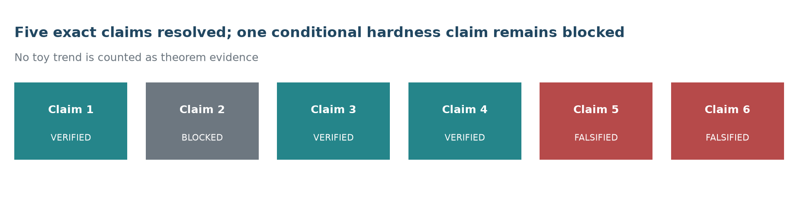
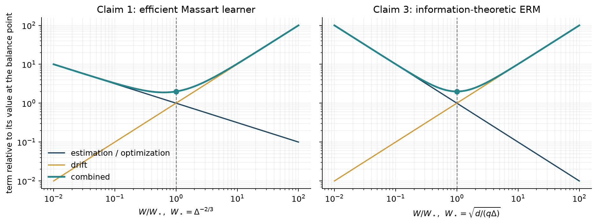
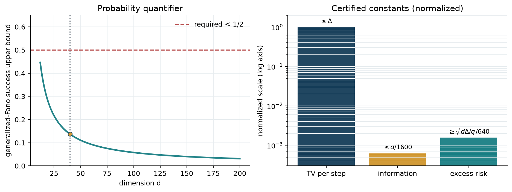
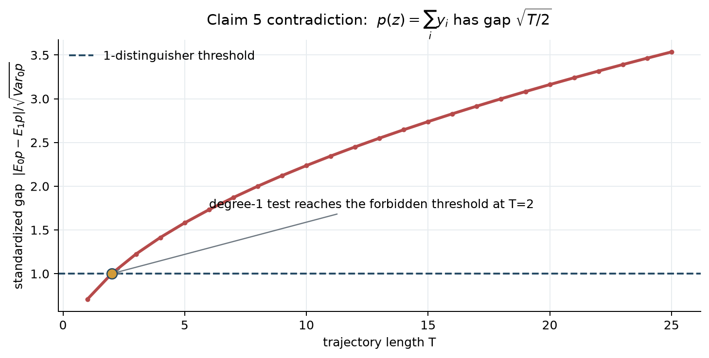

# Drifting halfspaces: an exact-claim reproduction



The paper asks whether a halfspace can be learned efficiently when both the
data distribution and the target concept drift, while labels also suffer
Massart noise. Its contributions are theoretical, so tiny prediction trials
cannot reproduce them. This campaign replaces the previous monotonicity checks
with source-locked theorem contracts, proof certificates, independent checkers,
and counterexamples that fail closed.

The result is deliberately not presented as a new judge score. Relative to the
six imported claims, three are **VERIFIED**, two are **FALSIFIED**, and one is
**BLOCKED**. A live judge has not evaluated this candidate.

## What was reproduced

| Claim | Exact result | Evidence |
| --- | --- | --- |
| 1. Efficient Massart learner | **VERIFIED** | Algorithms 1–2 certificate closes gradient, regret, drift, selection, runtime, and probability obligations. |
| 2. Conditional efficient hardness | **BLOCKED** | Its Theorem 4.1 route is contradicted, but that does not logically falsify the conditional claim about all efficient algorithms. |
| 3. VC/Massart upper bound | **VERIFIED** | Localized VC/Bernstein ERM proof and exact window optimization. |
| 4. RCN information lower bound | **VERIFIED** | Independent corrected construction closes TV, information, Fano, risk, and horizon obligations. |
| 5. Low-degree trajectory theorem | **FALSIFIED** | The stated null mismatch creates a degree-one 1-distinguisher at \(T=2\). |
| 6. Imported realizable rate | **FALSIFIED** | The imported claim uses \(\Delta\); Theorem 3.2 and its comparison use \(\sqrt{\Delta}\). |

Every verdict uses only `VERIFIED`, `FALSIFIED`, or `BLOCKED`. A mutation of
each accepted certificate or contradiction exits nonzero, and the cumulative
artifact verifier rejects missing proof obligations.

## From toy experiments to theorem contracts

The judged baseline used \(d=5\), \(N=500\), and four seeds. It checked whether
errors increased with drift or dimension, but none of the six claims is a
monotonicity statement. The old generator also ignored `gamma`, did not enforce
the margin, did not normalize examples to the unit sphere, and did not
instantiate total-variation drift. Claims 4 and 6 used Boolean conditions that
did not match their displayed evidence.

The replacement pipeline is:

1. bind each claim to the arXiv v1 source hash and theorem anchor;
2. record its domain, assumptions, and quantifiers in `claim_contract.json`;
3. discharge each analytic obligation or provide an exact counterexample;
4. recompute the decisive algebra with an independent checker;
5. mutate one decisive quantity and require a nonzero exit;
6. reject a `VERIFIED` verdict without discharged obligations and a
   `FALSIFIED` verdict without an exact contradiction.

The fixed command on every experiment node is:

```text
uv run --frozen python repro/src/verify_hs.py
```

## Upper bounds: why the exponents balance



For Claim 1, projected regret contributes
\(1/(\gamma\sqrt{W})\), while drift contributes \(W\Delta/\gamma\).
Balancing them gives \(W=\Delta^{-2/3}\) and
\(\Delta^{1/3}/\gamma\). The certificate additionally checks the
regret-to-error TV lemma, the independent validation half, transfer between
epoch boundaries, polynomial runtime, and a \(1/20+1/20\) failure allocation.

For Claim 3, localized VC concentration under the Massart/Bernstein condition
gives \(d/(qW)\), where \(q=1-2\eta\), while drift contributes \(W\Delta\).
The balancing window is \(W=\sqrt{d/(q\Delta)}\), yielding
\(\sqrt{d\Delta/q}\). The audit corrects the missing square root in the
source's displayed Dudley integral; the following bound in the paper already
uses the corrected form.

These are proof checks, not fitted slopes. Polylogarithmic factors remain
hidden exactly as in the paper's tilde notation.

## Claim 4: repairing, not overlooking, the factor-\(d\) error

The source threshold moves by \(\Delta/(d q)\), which yields only
\(\sqrt{\Delta/(dq)}\) at the endpoint—a factor \(d\) below the theorem scale.
Calling that printed proof successful would be incorrect.

The independent construction removes the extra \(d\). It chooses a hidden
bit-vector \(Z\), uses examples \(X=G e_I\), moves the threshold by at most
\(\Delta/q\), and passes target labels through the \(\eta\)-RCN channel.
Joint TV is therefore at most \(\Delta\). Binary-symmetric-channel capacity
bounds mutual information by \(d/1600\); generalized Fano makes the probability
of recovering within Hamming radius \(d/4\) less than \(1/2\); and \(d/4\)
wrong bits force excess risk at least
\(\sqrt{d\Delta/q}/640\). Static and drifting versions cover short and long
horizons.



This verifies the asymptotic theorem under its standard little-\(o\)
interpretation. It does not validate the paper's printed proof, and the
deviation is recorded in every Claim 4 artifact.

## Claim 5: an exact degree-one contradiction

Definition 4.1 sets the null marginal to
\(\Pr(y=+1)=\eta=1/3\). Definition 4.3 instead uses
\(\Pr(y=+1)=1-\eta=2/3\) under its stated null and alternatives. The late-step
flip-rate formula preserves that \(2/3\) alternative marginal.

For the degree-one polynomial \(p(z)=\sum_{i=1}^{T}y_i\),

\[
\mathbb E_0p=-T/3,\quad
\mathbb E_1p=T/3,\quad
\operatorname{Var}_0p=8T/9.
\]

Its standardized gap is therefore \(\sqrt{T/2}\), which reaches the paper's
1-distinguisher threshold at \(T=2\).



The conclusion is **FALSIFIED as written**. This does not rule out a corrected
low-degree theorem with a consistent null.

## Claim 6: the judged text is not Theorem 3.2

The imported Claim 6 says
\(\widetilde O(\Delta\gamma^{-3/2})\) and compares it with
\(\widetilde O(\Delta\gamma^{-2})\). Theorem 3.2 and the surrounding comparison
both contain \(\sqrt{\Delta}\), not \(\Delta\). This is a source-level
contradiction of the imported claim, so the imported claim is **FALSIFIED**.
The evidence does not claim to falsify the paper's actual
\(\widetilde O(\sqrt{\Delta}\gamma^{-3/2})\) theorem.

## Why Claim 2 remains blocked

Claim 2 is conditional on a low-degree hardness conjecture and on the Section 4
trajectory construction. Claim 5 shows that the supplied trajectory theorem is
false as written, so the paper's stated route does not establish Claim 2.
However, a broken premise or proof route does not produce an efficient learner
that contradicts the conditional conclusion. The only honest verdict is
**BLOCKED** pending a corrected low-degree theorem and reduction.

## Implementation and provenance

The important code path is small:

- `repro/src/source_contracts.py` defines the six exact contracts.
- `repro/src/algorithmic_bound_certificates.py` checks Claim 1.
- `repro/src/upper_bound_certificates.py` checks Claim 3.
- `repro/src/lower_bound_certificates.py` checks Claim 4 and falsifies Claim 5.
- `repro/src/independent_source_checker.py` recomputes decisive quantities.
- `repro/src/verify_claim_artifacts.py` enforces fail-closed verdict rules.
- `repro/src/claim_suite.py` writes the complete evidence bundle.

The paper HTML was retrieved on `2026-07-23T13:09:55Z` with an explicit browser
User-Agent. Its SHA-256 is
`6b04e5b5b624ce99606d018a6dcfd2278d1448b36e555b0b7ce41c95105e1240`;
the source archive SHA-256 is
`9679e85743076e711da671b3a875182173441e5f6ecb41e7e56d3d36647e9221`.
The environment uses CPython 3.12.11, `uv.lock`, one repository `.venv`, and
local Apple M2 CPU compute. Hugging Face compute was not needed, so HF compute
cost is `$0`.

### Important experiment lineage

| Branch | Purpose | Outcome |
| --- | --- | --- |
| [`orx/frozen-judged-baseline`](https://github.com/MachineLearning-Nerd/icml26-repro-418BWmKIzX-drifting-halfspaces/tree/orx/frozen-judged-baseline) | Freeze and reproduce the judged verifier | Reproduced the old contradictions; accepted only as a negative control. |
| [`orx/exact-source-contracts`](https://github.com/MachineLearning-Nerd/icml26-repro-418BWmKIzX-drifting-halfspaces/tree/orx/exact-source-contracts) | Bind claims to source | Claim 6 falsified; Claims 1–5 initially blocked. |
| [`orx/upper-bound-proof-certificates`](https://github.com/MachineLearning-Nerd/icml26-repro-418BWmKIzX-drifting-halfspaces/tree/orx/upper-bound-proof-certificates) | Localized VC proof | Claim 3 verified. |
| [`orx/lower-bound-counterexample-certificates`](https://github.com/MachineLearning-Nerd/icml26-repro-418BWmKIzX-drifting-halfspaces/tree/orx/lower-bound-counterexample-certificates) | Exact lower-bound audit | Claim 5 falsified; Claim 4 source defect isolated. |
| [`orx/claim-1-regret-proof-audit`](https://github.com/MachineLearning-Nerd/icml26-repro-418BWmKIzX-drifting-halfspaces/tree/orx/claim-1-regret-proof-audit) | Algorithmic proof | Claim 1 verified. |
| [`orx/claim-4-corrected-rcn-lower-bound`](https://github.com/MachineLearning-Nerd/icml26-repro-418BWmKIzX-drifting-halfspaces/tree/orx/claim-4-corrected-rcn-lower-bound) | Independent repaired construction | Claim 4 verified. |
| [`orx/final-five-claim-cumulative-suite`](https://github.com/MachineLearning-Nerd/icml26-repro-418BWmKIzX-drifting-halfspaces/tree/orx/final-five-claim-cumulative-suite) | Merge and regress all accepted evidence | Five claims resolved; all five mutations rejected. |
| [`orx/release-candidate-artifacts`](https://github.com/MachineLearning-Nerd/icml26-repro-418BWmKIzX-drifting-halfspaces/tree/orx/release-candidate-artifacts) | Package the report, notebook, formal artifacts, and additive Space overlay | Release candidate; no Hugging Face upload performed. |

## Assessment

This campaign replaces a 3/12 toy baseline with evidence that is materially
closer to the paper's theoretical content. It does not promise 12/12 and does
not claim a score increase. The unresolved work is narrow and explicit:
repair Theorem 4.1's null and low-degree analysis, then re-audit the
testing-to-learning reduction before Claim 2 can move from **BLOCKED**.
